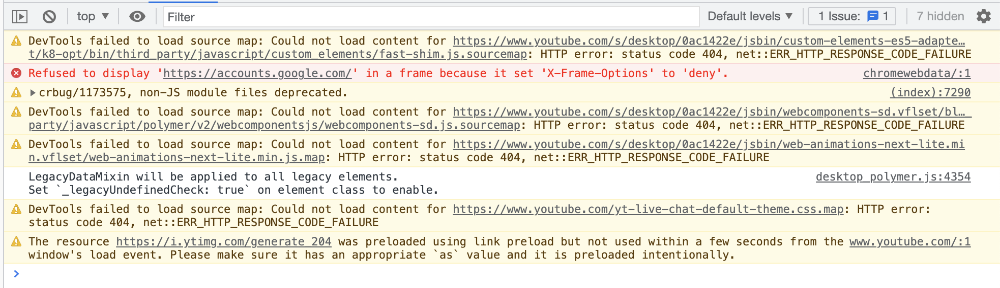
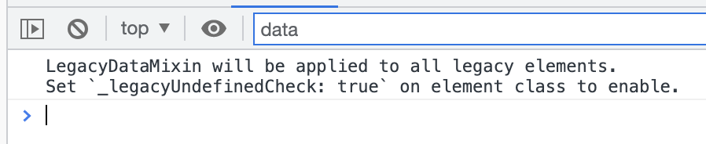
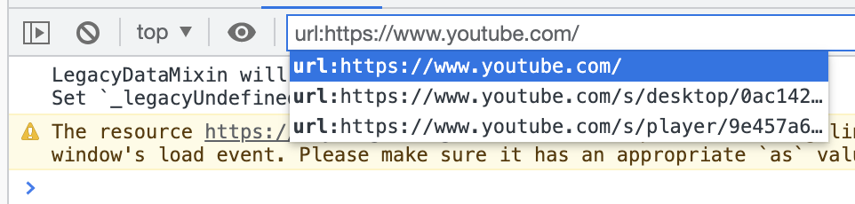

Today I learn that you can filter logs like those generated by `console.log` by using [URL filters](https://developer.chrome.com/blog/new-in-devtools-62/#url-filters) on Google Chrome.

Unfiltered logs from <a href="https://youtube.com/">youtube.com</a>.

You can type any substring in the "Filter" input on Google Chrome's DevTools console like this:

Logs filtered by substring.

In the image above you can notice that the substring "data" is contained in the
filtered logs.

You can also filter logs from a specific domain. You can type `url:` and an
autocomplete menu will be displayed like this:

Filtering logs by url.

You can select a top domain, a specific script from the list, or your own
substring from the domain like "tube" and it will filter the logs matching that
domain.

*Tip: if for some reason you close the autocomplete list, you can click `ctrl + l` to open it again.*

You can even include regular expressions like `/^=/` to include logs that start
with a `=` or `-/^=/` to include logs that don't start with a `=`.

To exclude multiple words by using multiple regular expressions like this `-any -of -this -words -will -be -included -in -the -logs`.

That's it! I hope this little tip is useful to you!

---

*Cover image by <a href="https://unsplash.com/@daphne_befrenchie?utm_source=unsplash&utm_medium=referral&utm_content=creditCopyText">Daphné Be Frenchie</a> on <a href="https://unsplash.com/s/photos/filter?utm_source=unsplash&utm_medium=referral&utm_content=creditCopyText">Unsplash</a>*
  
