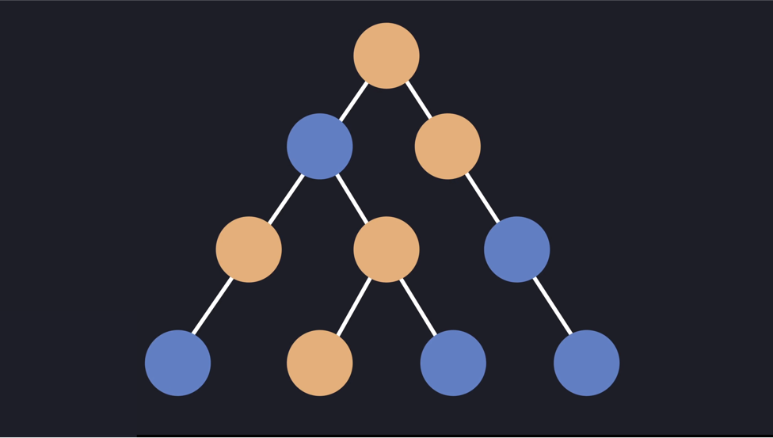

import Warning from '../../components/Warning'

<Warning>
  Server Components are a research in progress and are by far production-ready. You don't need them to use React nor you shouldn't hurry to learn this. Continue reading just if you're curious about what's going on in the React community.
</Warning>

It's almost the end of the year and the React team decided to give us a sneak peak of their current research as a Christmas 🎄 gift: Server Components ⚛️.

React Server Components were announced a few hours ago. You can check the talk and demo that the React team prepared below and check the introductory blog post [here](https://reactjs.org/blog/2020/12/21/data-fetching-with-react-server-components.html).

<iframe width="560" height="315" src="https://www.youtube.com/embed/TQQPAU21ZUw" frameborder="0" allow="accelerometer; autoplay; clipboard-write; encrypted-media; gyroscope; picture-in-picture" allowfullscreen></iframe>

# What are React Server Components?
Here's a definition of React Server Components:

> React Components are a research in progress that allows you to execute
some components on the server and thus, reduce client-size bundle size.

Server Components [execute on the server and on the server only. They never ship to the client.](https://youtu.be/TQQPAU21ZUw?t=675)

To understand Server Components, let's visualize how a React app looks like:


A blue node represents a node that runs on the client. Let's add some Server
Components (represented as orange nodes):



As you can see, Server Components gets rendered mixed with client components.
**They're not rendered to HTML** but instead they're a representation of a React
Component generated on the server so we can render Server Components that
contain Client Components.

The main benefit of Server Components is that the bundle size is reduced because
you don't need to send code that is used once to the client, but instead just
run it on the server.


For example, below is a `Note` component that executes only on the server:


As you can see, since the `Note` component gets rendered only on the server, we
can skip the need to download its dependencies on the browser. The result: zero
-bundle-size React Server Components 🤯

Notice that [Server Components are different than Server Side Rendering (SSR)](https://twitter.com/sugarpirate_/status/1341141198258524163?s=20) because SSR works as follows:

- Receive request.
- Render response on the server.
- Return HTML to the user as fast as possible (at this point the app isn't
  interactive yet).
- Display response on the user's browser.
- Start downloading the whole React app on the client
- Load app on the client to enable interactivity.

On the other hand, Server Components [Don't render to HTML, but instead, they render to a special format](https://youtu.be/TQQPAU21ZUw?t=1558). Let's call it Server Component Tree for now. It looks like this:


Here's how it would look formatted (I modify it a bit to have syntax highlight
enabled):

```json
{
  M1: {
    "id": "./src/SearchField.client.js",
    "chunks": ["client5"],
    "name": ""
  },
  {
    M2: {
    "id": "./src/EditButton.client.js",
    "chunks": ["client1"],
    "name": ""
  }
}
```

It doesn't matter what each piece here does. The important thing here is that Server Components is not the same that Server Side Render. In fact, Server Components are not a replacement or an alternative to Server Side Rendering, but instead, [they're complementary](https://youtu.be/TQQPAU21ZUw?t=1567) so you can [use them together](https://youtu.be/TQQPAU21ZUw?t=1582).

# How to Use Server Components
With the introduction of Server Components, we have three types of React components:

- **Shared Components**: the components that you currently use. You can execute them
  both on the client and the server.
- **Server Components**: only execute on the server and must have the `.server.js` extension.
- **Client Components**: only execute on the client and must have the `.client.js` extension.

*Note: Server Components can't have state nor event listeners. If you
want interactiveness, you need to use client components.*

Shared components will be executed on the server or the client depending on its
parent component:

- If the parent component is a Server Component, the Shared Component will be executed on the server.
- If the parent component is a Client Component, the Shared Component will be executed on the client.

# Adoption
The initial adoption of Server Components will be through frameworks (e.g: [Next.js](https://nextjs.org/)) mostly because [it requires integration with an application's routing system and bundler](https://github.com/reactjs/rfcs/blob/2b3ab544f46f74b9035d7768c143dc2efbacedb6/text/0000-server-components.md#adoption-strategy). Framework integration will make it easy for the community to understand how Server Components work. The idea in the future is to be framework-agnostic so you can run your own version of Server Components.

If you want to get an idea of the potential improvements of Server Components, [Facebook saw a 30% of product code size reduction after the adoption of Server Components](https://github.com/reactjs/rfcs/blob/2b3ab544f46f74b9035d7768c143dc2efbacedb6/text/0000-server-components.md#is-this-in-production-at-facebook),
and there's still work left so this number can increase!

# Conclusion
Server Components are a promising proposal to React. They would allow us to
reduce the bundle size of our apps without too much effort on our side. Here's a
list of the main takeaways for Server Components:

- [Zero effect on bundle size](https://youtu.be/TQQPAU21ZUw?t=2217)
- [Access backend resources directly](https://youtu.be/TQQPAU21ZUw?t=2266)
- [Load only the code that is necessary](https://youtu.be/TQQPAU21ZUw?t=2464)
- [Let you decide the tradeoff for every concrete use case](https://youtu.be/TQQPAU21ZUw?t=2599)
- [Provide modern UX with a server-driven mental
  model](https://youtu.be/TQQPAU21ZUw?t=2666)

One of the greatest things about Server Components is that you can decide [where to add interactivity on a per-component basis](https://twitter.com/sophiebits/status/1341148852045271040?s=20).

And again, remember that this is still in research and development and it's presented to us so we can know what the react team is working on and how they envision the future of React (it looks promising 🚀).

# FAQ
- **Where in the stack are suppose to be Server Components?**
React Server Components are not mean to be added to React, but instead they are mean to be added to bundlers like
[webpack](https://webpack.js.org/) or [parcel](https://parceljs.org/).

**Should I use Server Components on a production app?**
Server Components are still on its early stages, so maybe it's not a good idea.

**Server Components are a replacement for Server Side Rendering (SSR)?**
[No](https://github.com/reactjs/rfcs/blob/2b3ab544f46f74b9035d7768c143dc2efbacedb6/text/0000-server-components.md#does-this-replace-ssr). They're different techniques and are complementary [they're complementary](https://youtu.be/TQQPAU21ZUw?t=1567) so you can [use them together](https://youtu.be/TQQPAU21ZUw?t=1582). SSR provides fast feedback to users by pre-rendering HTML on the server and adding interactivity on the client.

**Server Components replace GraphQL?**
[No](https://github.com/reactjs/rfcs/blob/2b3ab544f46f74b9035d7768c143dc2efbacedb6/text/0000-server-components.md#does-this-replace-ssr). You can still have a GraphQL server if it makes sense for your application.
In fact, some of Facebook's Server Components use GraphQL.

**Do I need to learn Server Components to use React in the future?**
[No](https://github.com/reactjs/rfcs/blob/2b3ab544f46f74b9035d7768c143dc2efbacedb6/text/0000-server-components.md#do-i-have-to-use-this). Server Components are completely opt-in so current React apps will not be
affected by them.

**Can  I mix Server and Client Components?
[Yes](https://twitter.com/sophiebits/status/1341098389010665473?s=20). You can have Server Components that render Client components inside and vice-versa.

**Is safe to fetch data from  a database in  Server Components?**
Yes. Server Components only execute on the server and never reach the user's
browser so it's safe to run database queries on them. Remember that you still
need a wrapper like `react-pg` to be able to run queries on Server Components.
