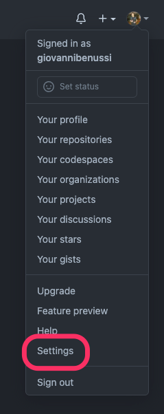
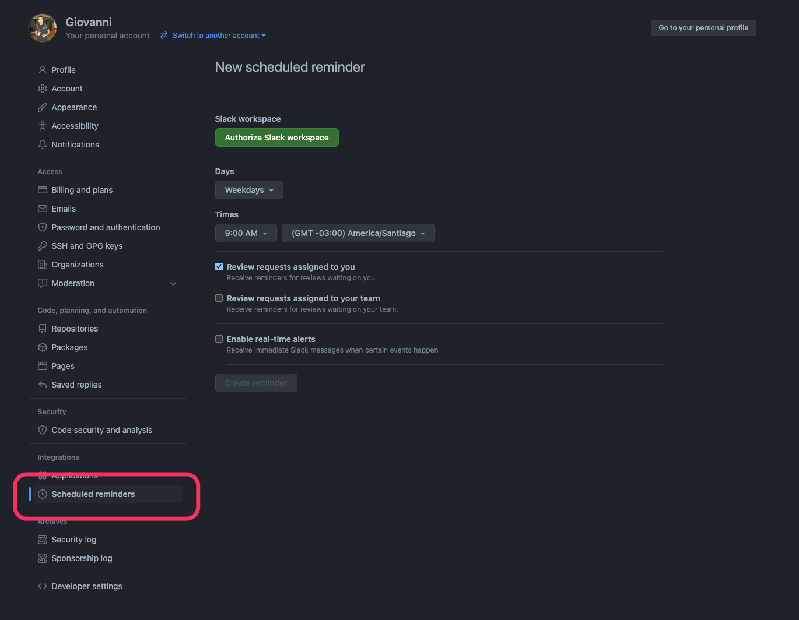
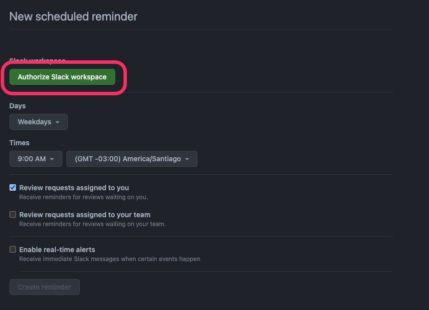
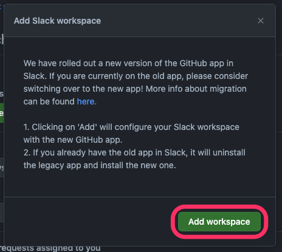
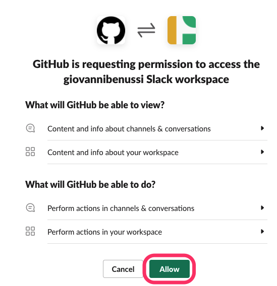
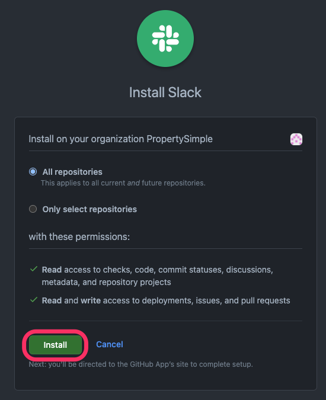
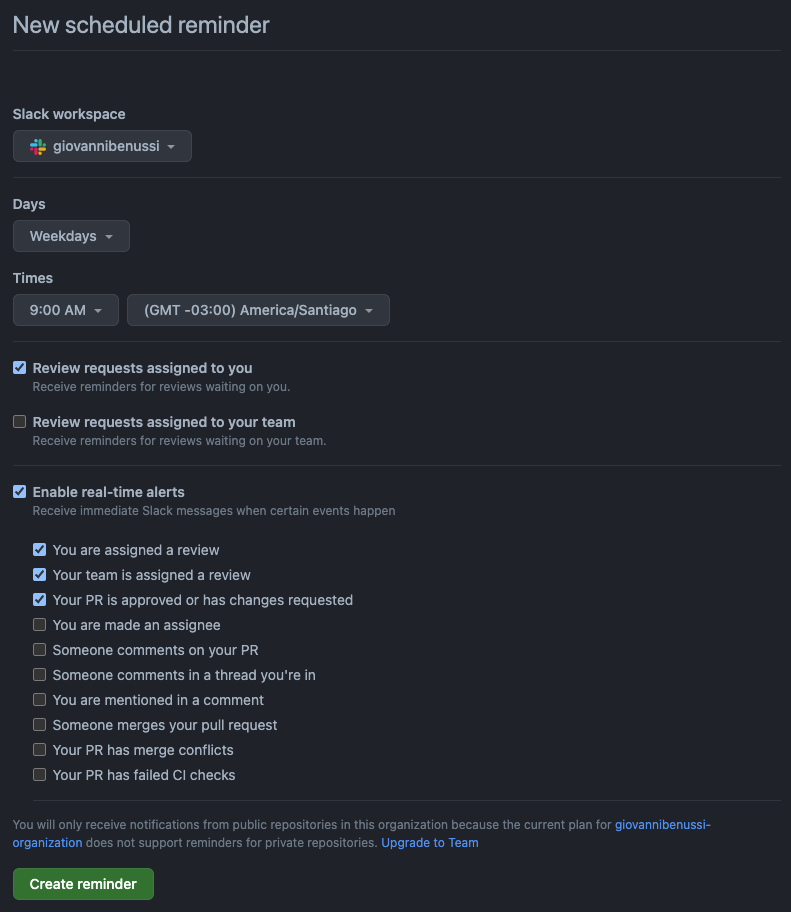

[Scheduled
reminders](https://github.blog/2020-04-21-stay-on-top-of-your-code-reviews-with-scheduled-reminders/)
were launched last year and  allows you to get customizable notifications about pull
requests waiting for you to review at any time you choose, which makes it ideal
to adapt to your workflow.

Last week, Jared Palmer tweeted about a way to setting up scheduled reminders on
Slack:

  <blockquote class="twitter-tweet">
Setting up GitHub reminders for my work Slack on weekdays at 9am and 2pm has been absolutely life changing. No more missed PR reviews and I effectively never need to deal w/ GitHub&#39;s Notification ui <a href="https://t.co/l3jgifru6F">pic.twitter.com/l3jgifru6F</a>
&mdash; Jared Palmer (@jaredpalmer) <a href="https://twitter.com/jaredpalmer/status/1486403287867867144?ref_src=twsrc%5Etfw">January 26, 2022</a></blockquote>

It looked pretty nice so I needed to give it a try. I didn't find any guide
 about how to do it I so decided to write one! 😬

**Prerequisites**

- A GitHub Organization (if you don't, [it takes 1 minute to do so](https://docs.github.com/en/organizations/collaborating-with-groups-in-organizations/creating-a-new-organization-from-scratch))
- A Slack Workspace (a company slack, for example, or [create one for free](https://slack.com/get-started#/create))

[Visit your settings page](https://github.com/settings/profile) or click
“Settings” on the dropdown after you click your profile image at the top right
on [GitHub](https://github.com/):

Then click on "Scheduled reminders" at the bottom of the left sidebar:

You are on the scheduled reminders page now. You need to give GitHub permissions
to access your Slack workspace in order to be able to recive notifications. To
do so, click on "Authorize Slack workspace" as shown below.

Then click on "Add workspace":

Authorize GitHub to access your Slack workspace:

And finally, select the repositories that will have Slack installed and click
"Install":

That's it! 🎉 You can configure your scheduled reminders and real-time alerts on the
scheduled reminders page!

