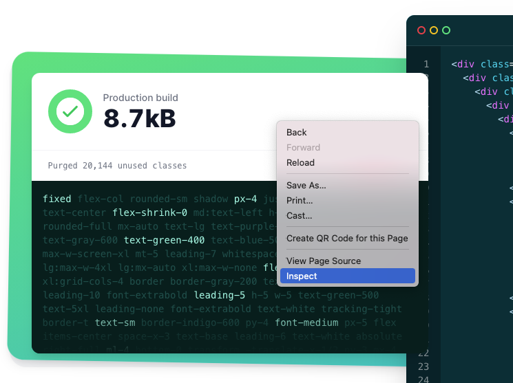
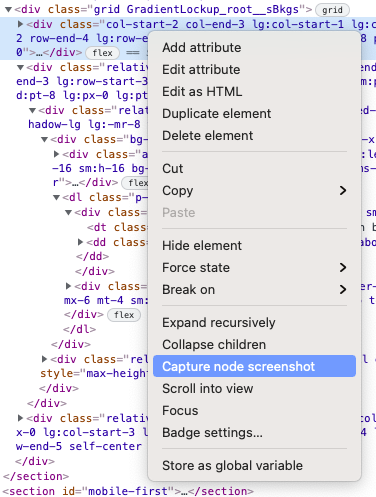
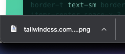

import Basic from './Examples/Basic'
import InlineStyle from './Examples/InlineStyle'

Here's a neat tip: if you want to take an screenshot of a DOM node, you can inspect the element by right clicking it and select *"Inspect"* as shown below:

Inspecting an element from <a href="https://tailwindcss.com/">Tailwind's official website</a>.

And then click *"Capture node screenshot"*:

That's it! Your browser will download an screenshot of that DOM node to your
*Downloads* folder.

