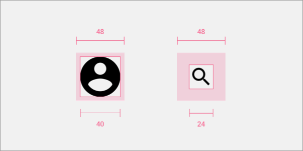
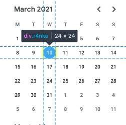
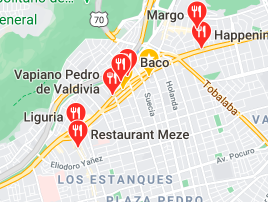

It's common to see websites on devices besides a desktop computer like a phone or a tablet. We can plan our whole week, purchase stuff online, take a class, and even track what we it with them. However, not every website is optimized for a mobile experience besides responsive design. One aspect that is not commonly addresses is to provide a good touch target that makes your website easier to use.

## What's a touch target?
A touch target is a part of the screen that a user can interact with. This could
be a button, link, image, a dropdown menu, an avatar, etc.

## Sizing
Good sizing is an important aspect of touch targets. Sometimes, clickable
elements are too small or they are too close between each other so and people have troubles trying to click them.

For example, in the image below, the icons and the available area to click them are not the same. The main idea is to
provide enough surface area to users so they can click what they want.

Photo by <a href="https://unsplash.com/@dollargill?utm_source=unsplash&amp;utm_medium=referral&amp;utm_content=creditCopyText">Dollar Gill</a> on <a href="https://unsplash.com/s/photos/book?utm_source=unsplash&amp;utm_medium=referral&amp;utm_content=creditCopyText">Unsplash</a>

Imagine how hard is to select the date that we want in Google
Calendar on mobile:

The primary action, or actions that are used frequently, should have a bigger size so users can reach them easily.

[*Important actions with severe consequences can't affort any kind of error*](https://docs.microsoft.com/en-us/windows/win32/uxguide/inter-touch#guidelines-for-touch-input), and thus, we should avoid them as much as possible. A solution to this problem could be to increase the size of all targets to reduce the likelihood of a mistake.

[Fitts Law](https://en.wikipedia.org/wiki/Fitts%27s_law) states:

> The time required to rapidly move to a target area is a function of the ratio between the distance to the target and the width of the target.

So, the smaller the target is, the harder will be for the users to reach them.

You might wonder if this is really an issue. Let me list a few cases where it
might be:

- People with precision problems.
- Using phone under movement (e.g: in the subway).
- Target size too small, and thus, hard to click.
- Finger or pointer device obstructing the user's view.
- Too many targets that are close each other.

### Ideal touch target size
There's one study called [Target Size Study for One-Handed Thumb Use on Small
Touchscreen
Devices](https://www.microsoft.com/en-us/research/wp-content/uploads/2006/01/parhi-mobileHCI06.pdf) where the authors analyzed the minimum target size so users can perform their tasks quickly and with accuracy. They found that the minimum target size should be a physical 1cm x 1cm.

There's one study called [Target Size Study for One-Handed Thumb Use on Small
Touchscreen
Devices](https://www.microsoft.com/en-us/research/wp-content/uploads/2006/01/parhi-mobileHCI06.pdf) where the authors analyzed the minimum target size so users can perform their tasks quickly and with accuracy. They found that the minimum target size should be a physical 1cm x 1cm.

## Closeness
When there's no enough space to display elements to the users and elements
overlap each other, it becomes hard to accurately tap the target that we
want. Let's take [Google Maps](https://www.google.com/maps)' search result for restaurants:

As you can notice, there are too many close results, and trying to click one of them becomes pretty hard.

Ideally, there should be enough spacing between targets. Google Material
Design recommends [a minimum of 8dp of space between each target](https://material.io/design/usability/accessibility.html#layout-and-typography).

Similar to size, [*important actions with severe consequences*](https://docs.microsoft.com/en-us/windows/win32/uxguide/inter-touch#guidelines-for-touch-input) need to be avoided. You can increase the separation between targets to avoid any kind of error when tapping important elements.

## Guidelines
There are different guidelines on the minimum to provide an ample touch target
to users. Below are some of them.

| Source | Common Elements (pt) | Important Elements (pt) |
| :----- | ---: | --:
| [Microsoft](https://docs.microsoft.com/en-us/windows/win32/uxguide/inter-touch#guidelines-for-touch-input) | 40x40 | 50x50
| [Material Design](https://material.io/develop/web/supporting/touch-target) | 48x48 | -
| [Apple's Human Interface Guidelines](https://developer.apple.com/design/human-interface-guidelines/ios/visual-design/adaptivity-and-layout/) | 44x44 | -

## Conclusion
A touch target is anything a user can interact with, and so, they should be easy
to click/tap. Strive for a touch target of at least 40x40pt and adjust as
needed.
