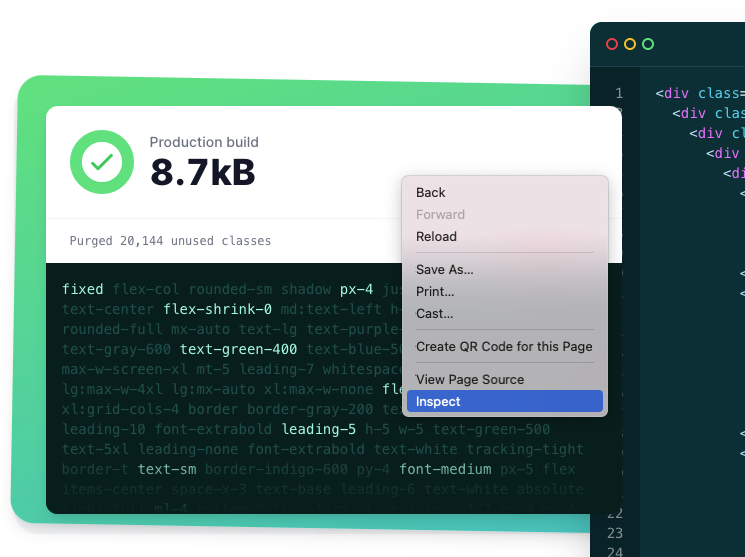
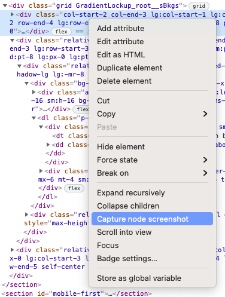
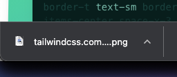

Here's a neat tip: if you want to take an screenshot of a DOM node, you can inspect the element by right clicking it and select *"Inspect"* as shown below:

*Inspecting an element from [Tailwind's official website](https://tailwindcss.com/).*

And then click *"Capture node screenshot"*:

That's it! Your browser will download an screenshot of that DOM node to your
*Downloads* folder.

